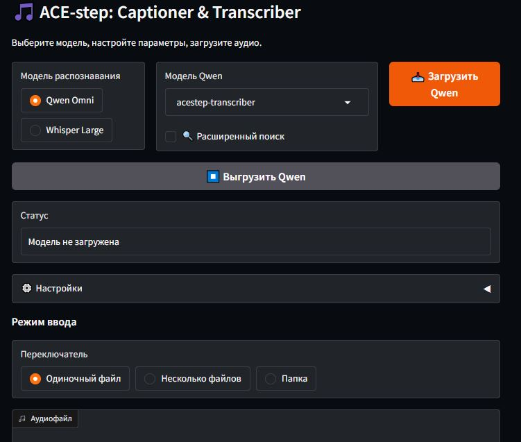

# 🎵 ACE-step: Captioner & Transcriber



Приложение для описания музыки (captioning) и транскрибации песен (transcription) с использованием моделей Qwen2.5-Omni и Whisper. Позволяет обрабатывать одиночные файлы, папки с аудио, применять шумоподавление, разделение на стемы (Demucs) и фрагментированную обработку.

## Возможности

- **Две модели распознавания**: Qwen Omni (для описания/транскрибации) и Whisper Large v3/v2 (только транскрибация)
- **Гибкая загрузка моделей**: поддержка квантизации (4/8 бит), Flash Attention, offload на CPU
- **Пакетная обработка**: несколько файлов или целая папка
- **Предобработка аудио**:
  - Шумоподавление (noisereduce)
  - Разделение на стемы (Demucs) – извлечение вокала, инструментала и т.д.
  - Обрезка по длительности
  - Фрагментированная обработка длинных аудио
- **Автоматическое и ручное сохранение** результатов (рядом с аудио или в выбранную папку)
- **Удобный интерфейс** на Gradio с кнопками выбора папок через проводник
- **Поддержка GPU** для ускорения (Demucs, модели)

## Установка

### Требования
- Python 3.12 (рекомендуется) или 3.10–3.12. Протестировано на Python 3.12.9
- CUDA (опционально, для GPU)

### Шаги

1. Клонируйте репозиторий:
```
   git clone https://github.com/AndyAnttle/ACE-step-Captioner-Transcriber.git
   cd ACE-step-Captioner-Transcriber
```

2. Создайте виртуальное окружение (рекомендуется):

```
python -m venv venv
source venv/bin/activate  # Linux/Mac
venv\Scripts\activate      # Windows
```

3. Установите зависимости:
Torch и требования к Python 3.12.9
```
pip install torch==2.7.0+cu126 torchvision==0.22.0+cu126 torchaudio==2.7.0+cu126 --index-url https://download.pytorch.org/whl/cu126
pip install -r requirements.txt
pip install flash-attn==2.7.4.post1 --no-build-isolation
```

4. Запустите приложение:

```
python app.py
```

После запуска откроется браузер с интерфейсом.

### Использование
Выберите модель распознавания (Qwen Omni или Whisper).

Если выбрана Qwen, укажите путь к папке с моделями (вы можете изменить его в коде MODELS_ROOT = r'ваш\\путь\\папка') и загрузите модель.

1. Для Whisper выберите версию и язык, затем загрузите модель.

2. Настройте параметры предобработки (шумоподавление, стемы, фрагментация и т.д.).

3. Выберите режим ввода: одиночный файл, несколько файлов или папку.

4. Нажмите кнопку запуска (название зависит от выбранной модели).

5. Результат появится в текстовом поле. Можно сохранить вручную или включить автосохранение.

### Примечания

Для работы Qwen Omni необходима особая версия transformers из ветки, она указана в requirements.txt.

При первом запуске Demucs загрузит веса модели (около 1 ГБ) в кэш.


Whisper large-v3 загружается при первом использовании (около 3 ГБ).
